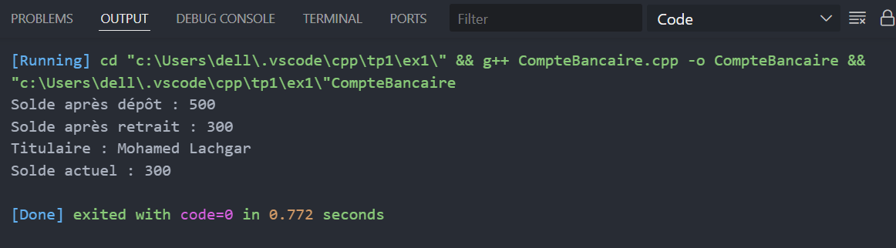

#  TP : Programmation Orientée Objet en C++  
## Exercice 1 & 2 — Gestion de Compte Bancaire et Catalogue de Livres

---

###  Objectif pédagogique
Ces exercices visent à renforcer la compréhension des **classes**, **méthodes membres**, **modificateurs d’accès**, et la **manipulation d’objets** en **C++** à travers deux cas concrets.

---

##  Exercice 1 : Gestion de Compte Bancaire Simple

###  Description
Cet exercice consiste à créer une classe **CompteBancaire** permettant de modéliser un compte avec un **titulaire** et un **solde**.  
Le programme permet d’effectuer des **dépôts**, **retraits**, et d’**afficher** le solde du compte.

---

###  Fonctionnalités
- Définir le **titulaire** du compte.  
- Effectuer un **dépôt**.  
- Effectuer un **retrait** (si le solde est suffisant).  
- Afficher les informations du compte.  

---

###  Résultat
Titulaire : Mohamed Lachgar  
Solde après dépôt : 500.0  
Solde après retrait : 300.0  

 

---

##  Exercice 2 : Gestion d’un Catalogue de Livres

###  Description
Ce programme modélise des **livres** dans une bibliothèque.  
Chaque objet de type **Livre** contient un **titre**, un **auteur**, et une **année de publication**.

---

###  Fonctionnalités
- Définir les informations d’un livre.  
- Afficher les informations du livre sous une forme lisible.  
- Accéder à l’année de publication via un accesseur.  

---

###  Résultat
Titre : Le C++ Moderne, Auteur : Bjarne Stroustrup, Année : 2013  
Titre : Programmation Orientée Objet, Auteur : Jean Dupont, Année : 2020  

 

---

###  Auteur
**Hamza Idhssaine**  
Étudiant à l’École Normale Supérieure de Marrakech — Département Informatique.
